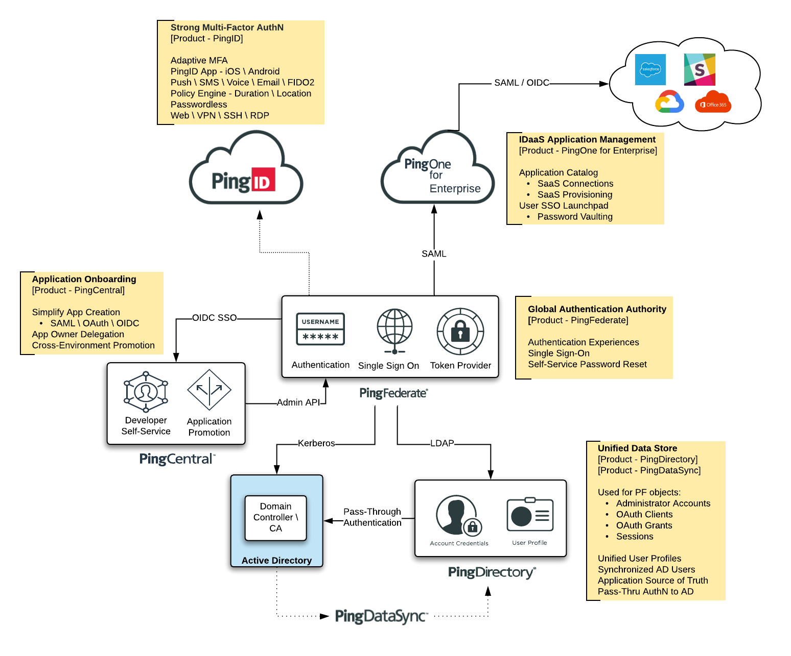

---
The Ping [**Workforce360**](https://www.pingidentity.com/en/solutions/workforce-identity/workforce360.html) Solution provides an Enterprise package that includes:
* Global Authentcation Authority (PingFederate) 
* Strong Multi-Factor Authentication (PingID) 
* IDaaS Application Management (PingOne for Enterprise)
* Unified Data Store (PingDirectory & PingDataSync) 
* Application Onboarding (PingCentral)

---
## Contents
* Deployment
  * [Pre-Requisites](docs/deployment-prerequisites.md)
  * [Environment Variables](docs/deployment-variables.md)
  * [Deployment - Docker Compose](deployment/Compose)
* Post Deployment
  * [Active Directory \ Kerberos](docs/ostdeployment-ad.md) 
  * [PingOne for Enterprise](docs/postdeployment-p14e.md)
  * [Secure LDAP to PingDirectory](docs/postdeployment-pdldaps.md)
* Configuration
  * [Admin Consoles](config-consoles.md)
  * [Authentication Authority (PingFederate)](docs/config-pingfed.md)
  * [Application Onboarding (PingCentral)](docs/config-pingcentral.md)
* Use Cases
  * [User Accounts](docs/usecase-users.md)
  * [Integrated Windows Authentication (Kerberos)](docs/usecase-kerberos.md)
---
